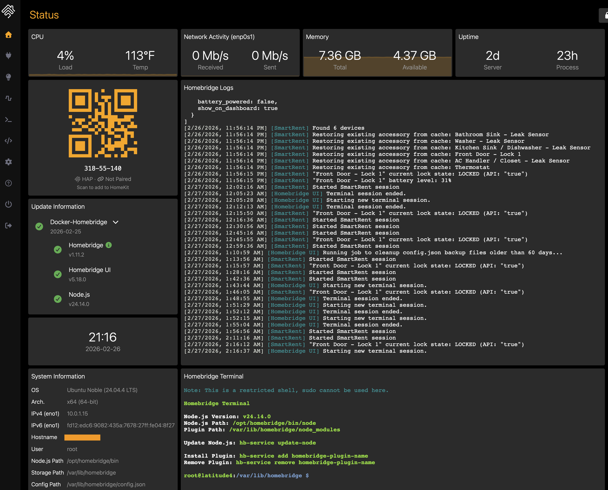
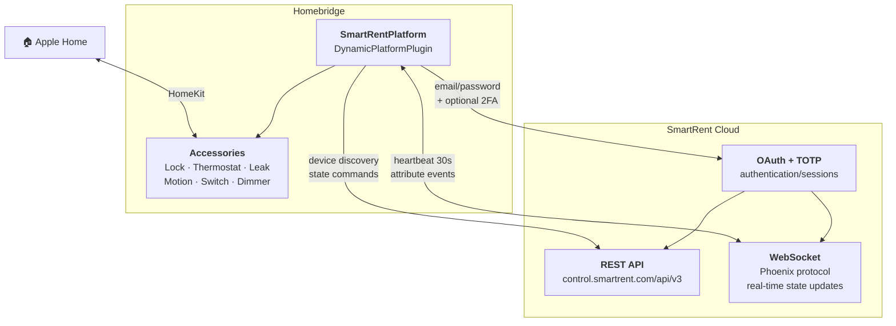
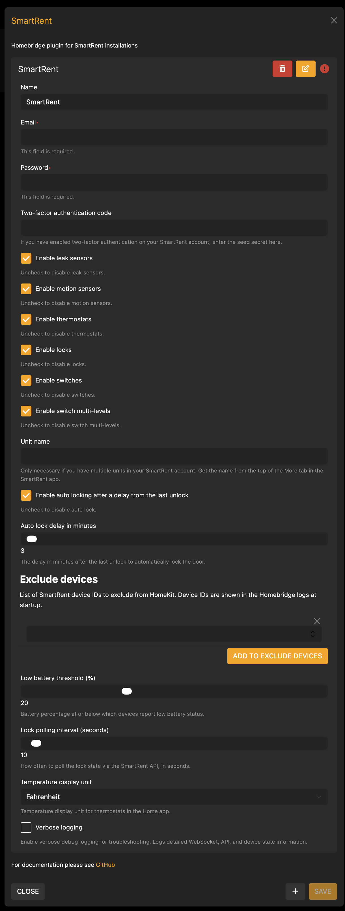

<span align="center">

<h1>
  <a href="https://github.com/BitWise-0x/homebridge-smartrent">
    
  </a>
  <br />
  Homebridge SmartRent
</h1>

[](https://github.com/homebridge/homebridge/wiki/Verified-Plugins)

[](https://www.npmjs.com/package/@jackietreeh0rn/homebridge-smartrent)
[](https://www.npmjs.com/package/@jackietreeh0rn/homebridge-smartrent)
[](https://github.com/BitWise-0x/homebridge-smartrent)
[](https://github.com/BitWise-0x/homebridge-smartrent)
[](https://github.com/BitWise-0x/homebridge-smartrent/pulls)
[](https://github.com/BitWise-0x/homebridge-smartrent/issues)
[](https://app.fossa.com/projects/git%2Bgithub.com%2FBitWise-0x%2Fhomebridge-smartrent?ref=badge_shield&issueType=license)

<!-- [](https://app.fossa.com/projects/git%2Bgithub.com%2FBitWise-0x%2Fhomebridge-smartrent?ref=badge_shield&issueType=security) -->

The most comprehensive [SmartRent](https://smartrent.com) Homebridge integration to date, [Homebridge](https://homebridge.io) Verified. Control your SmartRent devices with [Apple Home](https://www.apple.com/ios/home/): supporting 6 device types w/ real-time updates, battery monitoring, and advanced status reporting.

</span>

<br>

## Supported Devices

<div align="center">

| Device            | HomeKit Service         | Capabilities                                                                                                                                     |
| ----------------- | ----------------------- | ------------------------------------------------------------------------------------------------------------------------------------------------ |
| 🔒 Locks          | LockMechanism + Battery | <ul><li>Lock/unlock</li><li>Battery level</li><li>Low battery alerts</li><li>Jam detection</li><li>Auto-lock timer</li></ul>                     |
| 🌡️ Thermostats    | Thermostat + Fan        | <ul><li>Mode control (heat/cool/auto/aux heat)</li><li>Temperature</li><li>Humidity</li><li>Fan mode</li><li>Real-time operating state</li></ul> |
| 💧 Leak Sensors   | LeakSensor + Battery    | <ul><li>Leak detection</li><li>Battery level</li><li>Low battery alerts</li></ul>                                                                |
| 🔍 Motion Sensors | MotionSensor            | <ul><li>Motion detection</li><li>Real-time updates</li></ul>                                                                                     |
| 🔌 Switches       | Switch                  | <ul><li>On/off control</li></ul>                                                                                                                 |
| 💡 Dimmers        | Lightbulb               | <ul><li>On/off control</li><li>Brightness control</li></ul>                                                                                      |

</div>

All devices report online/offline status via the StatusActive characteristic.



<br>

## Architecture



<br>

## Features

- **Real-time updates** — WebSocket connection with Phoenix heartbeat for instant state changes across all devices
- **6 device types** — Locks, thermostats, leak sensors, motion sensors, switches, and dimmers
- **Accurate HVAC status** — Uses the thermostat's actual operating state (heating/cooling/idle), not just the target mode
- **Lock jam detection** — Detects and reports lock jams via SmartRent notification events
- **Battery monitoring** — Battery level and low-battery alerts for locks and leak sensors
- **Device online/offline status** — Reports device reachability for all device types
- **Two-factor authentication** — Full TOTP support for secured SmartRent accounts
- **Auto-lock** — Configurable timer to automatically re-lock after unlocking
- **Per-device toggles** — Enable or disable any device type independently via config

<br>

## Installation

[Install Homebridge](https://github.com/homebridge/homebridge/wiki), add it to [Apple Home](https://github.com/homebridge/homebridge/blob/main/README.md#adding-homebridge-to-ios), then install and configure Homebridge SmartRent.

### Recommended

1. Open the [Homebridge UI](https://github.com/homebridge/homebridge/wiki/Install-Homebridge-on-macOS#complete-login-to-the-homebridge-ui).

2. Open the Plugins tab, search for `homebridge-smartrent`, and install the plugin.

3. Log in to SmartRent through the settings panel, and optionally set your unit name.

<p align="center">
  
</p>

### Manual

1. Install the plugin using NPM:

   ```sh
   npm i -g @jackietreeh0rn/homebridge-smartrent
   ```

2. Configure the SmartRent platform in `~/.homebridge/config.json` as shown in [`config.example.json`](./config.example.json).

3. Start Homebridge:

   ```sh
   homebridge -D
   ```

<br>

## Configuration

| Property                  | Type    | Default      | Description                                                                                          |
| ------------------------- | ------- | ------------ | ---------------------------------------------------------------------------------------------------- |
| `email`                   | string  | _required_   | SmartRent account email                                                                              |
| `password`                | string  | _required_   | SmartRent account password                                                                           |
| `tfaSecret`               | string  |              | 32-character TOTP seed for two-factor authentication                                                 |
| `unitName`                | string  |              | Unit name — only needed if you have multiple units. Find it in the SmartRent app under the More tab. |
| `enableLocks`             | boolean | `true`       | Enable lock accessories                                                                              |
| `enableThermostats`       | boolean | `true`       | Enable thermostat accessories                                                                        |
| `enableLeakSensors`       | boolean | `true`       | Enable leak sensor accessories                                                                       |
| `enableMotionSensors`     | boolean | `true`       | Enable motion sensor accessories                                                                     |
| `enableSwitches`          | boolean | `true`       | Enable switch accessories                                                                            |
| `enableSwitchMultiLevels` | boolean | `true`       | Enable dimmer/multilevel switch accessories                                                          |
| `enableAutoLock`          | boolean | `false`      | Automatically re-lock after unlocking                                                                |
| `autoLockDelayInMinutes`  | integer | `5`          | Minutes to wait before auto-locking                                                                  |
| `excludeDevices`          | array   |              | List of SmartRent device IDs to exclude from HomeKit. Device IDs are shown in logs at startup.       |
| `lowBatteryThreshold`     | integer | `20`         | Battery percentage at or below which devices report low battery status (5–50)                        |
| `temperatureUnit`         | string  | `fahrenheit` | Temperature display unit for thermostats (`fahrenheit` or `celsius`)                                 |
| `verboseLogging`          | boolean | `false`      | Enable verbose debug logging for troubleshooting                                                     |

<br>

## Development

### Prerequisites

- Node.js 18.20.4+, 20.18.0+, 22.10.0+, or 24.0.0+
- Homebridge 1.8.0+ or 2.0.0-beta+

### Setup

```sh
npm install
npm run build
npm link
```

### Watch Mode

Automatically recompiles and restarts Homebridge on source changes:

```sh
npm run watch
```

This runs a local Homebridge instance in debug mode using the config at `./test/hbConfig/`. Stop any other Homebridge instances first to avoid port conflicts. The watch behavior can be adjusted in [`nodemon.json`](./nodemon.json).

### Linting & Formatting

```sh
npm run lint        # check for lint errors
npm run lint:fix    # auto-fix lint errors
npm run prettier    # check formatting
npm run format      # auto-fix formatting
```

Commits must follow [Conventional Commits](https://www.conventionalcommits.org/en/v1.0.0/#summary) — enforced by pre-commit hooks via [commitlint](https://commitlint.js.org/) and [husky](https://typicode.github.io/husky/).

<br>

## Troubleshooting

If you run into issues, check the [Homebridge troubleshooting wiki](https://github.com/homebridge/homebridge/wiki/Basic-Troubleshooting) first. If the problem persists, [open an issue](https://github.com/BitWise-0x/homebridge-smartrent/issues/new/choose) with as much detail as possible.

<br>

## Contributing

See [CONTRIBUTING.md](./CONTRIBUTING.md) for guidelines on bug reports, feature requests, and code contributions.

<br>

## Useful Resources

> **Read the full write-up:** [Homebridge SmartRent & Blink](https://blog.bitwisesolutions.co/blog/homebridge-smartrent-blink) — an architectural deep-dive into how both plugins map their respective APIs into HomeKit (HAP service composition, IMMI streaming, OAuth/2FA, motion polling).

- [Homebridge Developer Documentation](https://developers.homebridge.io/)
- [Apple HomeKit Documentation](https://developer.apple.com/documentation/homekit/)

<br>

## License

[GNU GENERAL PUBLIC LICENSE, Version 3](https://www.gnu.org/licenses/gpl-3.0.en.html)

<!-- [](https://app.fossa.com/projects/custom%2B56237%2Fgithub.com%2FBitWise-0x%2Fhomebridge-smartrent?ref=badge_large&issueType=license) -->

<br>

## Disclaimer

This project is not endorsed by, directly affiliated with, maintained, authorized, or sponsored by SmartRent Technologies, Inc or Apple Inc. All product and company names are the registered trademarks of their original owners. The use of any trade name or trademark is for identification and reference purposes only and does not imply any association with the trademark holder of their product brand.
